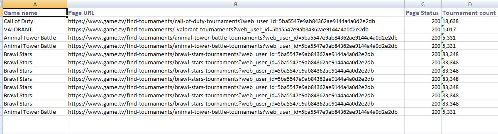

# Game.Tv Assignmeny #

## Key Features
- **Clone the repository**
- **Import and project in any IDE**
- **Open pom.xml and do CTRL+S this will install all dependency**
- **Run TestNg.xml as testsuite**
- **Open GameTv.xlsx at path src\test\resources\Excel\GameTv.xlsx and verify the result**

## Minimum Requirements
- Java 8

## Output Image
[]
